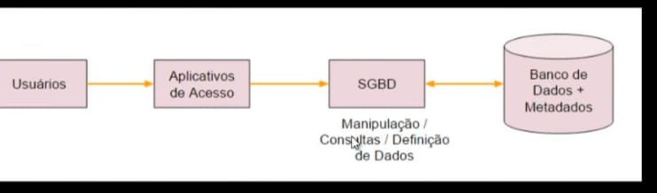
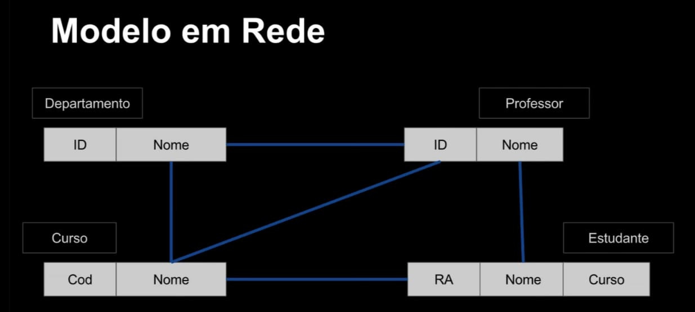
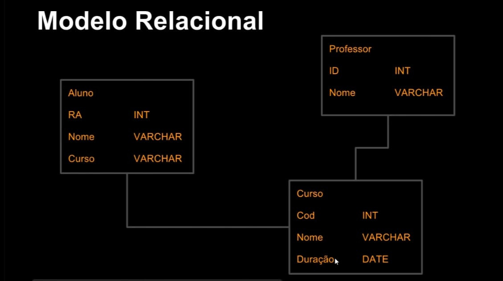
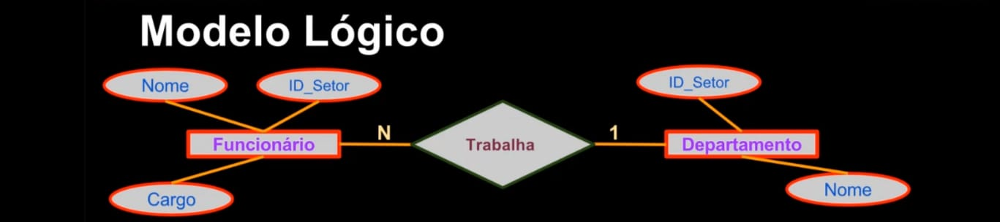
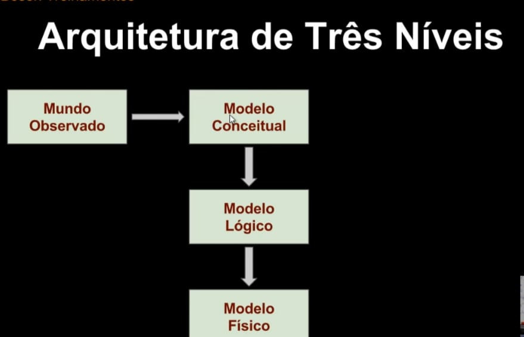

# **Dados x Informações**

Dados: São fatos em uma forma primária, que podem ser armazenados em algum meio.

 - EX.: CPF, Nome, Data

Informação: São os fatos organizaddos de maneira a produzir um significado -> Dados colocados em contexto.

 - Ex.: Lista de clientes com seus números de CPF, ordenados, onde os CPF estão em ordem que foram cadastrados.

# **Metadados**

 - Definimos Metadados com sendo "Dados sobre os dados".

 - Permitem efetuar a representação e identificação dos dados, garantindo sua consistência e persistência.

 - Os Metadados são mantidos no Dicionário de Dados (ou em um Catálogo de Dados).

# **Banco de Dados**

Um banco de dados (DB) é uma coleção organizada de dados. Esses dados são organizados de modo a modelar aspectos do mundo real, para que seja possível efetuar processamento que gere informações relevantes para os usuários a partir desses dados.

Um DB é composto por diversos objetos, tais como: tabelas, esquemas, visões, consultas, relatórios, procedimentos, triggeres, entre outros. O mais importantes são as tabelas e os relacionamentos.

**Triggers**: Os triggers em banco de dados são conjuntos de ações que são automaticamente executadas em resposta a eventos específicos, como INSERT, UPDATE ou DELETE. Eles podem ser usados para:

 - Manter a integridade dos dados
 - Realizar auditoria
 - Automatizar ações

Tipos
 - Before triggers (antes da operação)
 - After triggers (após a operação)

Importante
 - Podem aumentar a complexidade do banco de dados
 - Podem afetar o desempenho do banco de dados

# **Aplicações dos Bancos de Dados**

Bancos de dados encontram aplicações em inúmeras áreas, como:

 - Sistemas bancários
 - Reservas de hoteis
 - Controle de estoque em supermercados
 - Catálogo de livros em bibliotecas
 - E-commerce
 - Receita Federal
 - You Tube
 - Sites de comércio eletrônico
 - Plataformas de redes sociais
 - Blogs e portais de notícias
 - Business Intelligence (BI)
 - Data Mining
 - Análise de dados científicos
 - Aplicações de jogos online
 - Plataformas de aprendizado online
 - Sistemas de gerenciamento de conteúdo

# **SGBD**

 - Um SGBD é uma coleção de softwares que permite aos usuários criarem e manterem um ou mais bancos de dados.
 - São usados nas tarefas de definição, construção, manipulação e compartilhamento dos bancos de dados entre aplicações e  usuários.
 - Permitem proteger o banco de dados e mantê-lo ao longo do tempo.

# **Exemplos de SGBDs**

 - Oracle DataBse
 - Microsoft SQL Server - SGBDR -> SQL Server
 - MySQL
 - IBM DB2
 - SAP Sybase
 - MongoDB
 - Teradata
 - PostgreSQL
 - SQLite

# **Sistema de Bancos de Dados**

A figura a seguir ilustra a relação entre usuários, bancos de dados, SGBDs e as aplicações que acessam os dados.

# **Usuários de Bancos de Dados**

 - Administrador
 - Projetista / Desenvolvedor
 - Usuário Final
  
# **Características e Funcionalidades**

 - Controle de Redundância
 - Múltiplas Visões dos Dados
 - Controle de Concorrência - gerencia para evitar que um desenv. subscreva o que outro está tentando gravar.
 - Backup e Restauração
 - Restrições de Integridade - não poder cadastrar um produto sem que tenha o fornecedor, cadastrar o usuário sem que ele forneça o CPF para que seja escrito na tabela.

# **Modelo Hieráquico**

 - Neste modelo os dados são organizaddos de forma hierárquica, com conjuntos de tipos de registros interconectados por meio de ligações.
 - Uma ligação representa uma relação entre dois tipos de registros: pai e filho.
 - Um esquema no modelo hierárquico é um diagrama de estrutura em árvore.
 - O acesso aos dados é sempre unidirecsional, a partir do pai para o filho.

 

# **Modelo em Rede**

 - No modelo em Redes os dados são organizados em tipos e ligações entre dois registros.
 - Não há restrição hierárquica.
 - Tanto o esquema quanto ocorrências de dados são visualizados como um grafo direcionado.
 - (Grafo -> Tipo de estrutura de dados).

# **Mdelo em Rede**

# **Modelo Relacional**

 - Neste modelo os dados são separados em entidades, conforme cada assunto, e registrados como atributos dessas entidades.
 - As entidades se relacionam entre si e permitem que os dados sejam armazenados e recuperados de forma rápida e segura.

# **Introdução ao Modelo Relacional** 

# **Modelagem de Dados**

 - Modelagem de Dados é o processo de criação de um Modelo de Dados para um sistema de informação, com a aplicação de técnicas específicas de modelagem.
 - Trata-se de processos para definir e analisar requisitos de dados necessários para suportar processos de negócio com sistemas informatizados em organização.
 - Um modelo de dados fornece uma estrutura para os dados usados em um SI, com definições e formatos específicos.

# **Modelos de Dados**

 - Hierárquico
 - Rede
 - *Relacionla*
 - Orientado a Objetos
 - Não-Relacional
  
# **Modelo Relacional**

 - Os princípios do modelo relacional foram esboçados por E.F. Codd (IBM) em um artigo publicado em junho de 1970, intitulado " A Relational Model of Data for Large Shared Data Banks", no qual o Dr. Codd propôs o modelo relacional para sistemas de bancos de dados.
 - Antes disso eram usados modelos como o hierárquico e o modelo em rede.

# **Modelo Relacional**

 - No modelo relacional os dados são organizados em coleções de tabelas bidimeensionais.
 - Essas tabelas são também chamadas de "Relações".
 - Relação é uma forma de se organizar os dados em linhas e colunas.
 - Baseado em lógica e teoria de conjuntos.

# **Componentes do Modelo Relacional**

### O modelo relacional é composto, basicamente por:

 - Coleções de objetos ou relações que armazenam os dados
 - Um conjunto de operadores que agem nas relações, produzindo outras relações
 - Integridade de dados, para precisão e consistência.

# **Banco de Dados Relacional**

 - Um Banco de dados relacional é uma coleção de relações, que são tabelas bidimensionais, onde os dados são armazenados.
 - Como exemplo, podemos querer armazenar dados sobre os clientes de uma loja. Pora isso criamos tabelas para guardar diferentes conjuntos de dados relacionados a esses cslientes, como dados pessoais, dados de compras, crédito, e outras.
  
# **Componentes de um Banco de Ddos Relacional**

 - **Tabela**: estrutura básica de armazenamento no SGBDR. Armazena todos os dados necessários sobre algo do mundo real, como clientes, pedidos ou produtos, também chamada de Relação. Um banco de dados relacional pode conter uma ou mais tabelas.
 - **Tupla**: ou linha / registro, representa todos os dados requeridos por uma determinada ocorrência de entidade em particular. Por exemplo, os dados de um cliente específico. Cada linha em uma tabela dever ser identificada por uma chave primária, de modo a não haver duplicação de registros.
 - **Coluna**: unidade que armazena um tipo específico de dado (valor) - ou não armazena  nada, com valor nulo. Esta é uma *coluna não chave*, significando que seu valor pode se repetir em outras linhas da tabela.
 - **Relacionamento**: associação entre as entidades (tabelas), conectadas por chaves primárias e chaves estrangeiras.
 - **Outros**: índices, SP, Triggers, etc.
 - **Chave Primária**: coluna (atributo) que identifica um registro de forma exclusiva na tabela. Por exemplo, o CPF de um cliente, contendo um valor que não se repete.
 - **Chave estrangeira**: coluna que define como as tabelas se relacionam umas com as outras. Uma FK se refere a uma PK ou a uma chave única em outra tabela ( ou na mesma tabela). Por exemplo, na tabela de pedidos podemos ter uma chave estrangeira efetuando o relacionamento com a chave primária na tabela de clientes.

# ** Análise de Requisitos**

 - Nesta fase, são realizadas reuniões para coleta de informações, que analisam o que é exigido para o banco de dados a ser criado.
 - Os processos de negócio são definidos, e as entidades, atributos e relacionamentos do BD são documentados.
 - A análise é extremamente importante para o sucesso do projeto do BD.

# **Modelo Entidade-Relacionamento**

 - MER, cria um diagrama entidade-relacionamento a partir das especificações do negócio ou narrativas do usuário. Permite ilustrar as entidades em um negócio e também relacionamentos entre elas. Construímos o MER durante a fase de análise no ciclo de vida de desenvolvimento do sistema.
 - Um MER separa a informação necessária a um negócio das atividades que são realizadas no negócio.

# **Componentes do MER

 - **Entidade**: algo significativo, sobre o qual devemos possuir informações. Como exemplos, temos clientes, funcionários, pedidos e produtos.
 - **Atributos**: algo que descreve ou qualifica uma entidade. Por exemplo, a entidade cliente possui atributos que descrevem seu nome, endereço, telefone, número de identificação, entre outros. Atributos podem ser obrigatórios ou opcionais.
 - **Relacionamento**: trata-se de uma associação nemeada entre entidades, com um grau de associação. Por exemplo, clientes podem estar associados a pedidos.

# **Convenções para modelagem de entidades, relacionamentos e atributos**

 - **Entidades**: nome único, singular; em caixa alta;
 - **Atributos**: nome no singular; caixa baixa; atributos obrigatórios marcados com'*'; identificador único marcado com'#'.
 - **Relacionamentos**: nome identificador (verbo); opcionalidade("deve ser" ou "pode ser"); grau ou cardinalidade ('um e apenas um', ou 'um ou mais')
 - **Cardinalidade**: significa que cada entidade pode ser ou deve em relação de forma uma e apenas uma ou uma ou mais com outra entidade.

  **Identificador único (UID)**

  - Um identificador único é qulquer combinação de atributos ou relacionamentos que são usados para distinguir ocorrências de uma entidade. Cada ocorrência da entidade deve ser identificável de forma exclusiva.

# **Modelagem de Dados - Níveis**

## **Classificamos o processo de modelagem de dados em tr~es níveis**:

 - Modelo Conceitual ( alto nível) - MCD -> Modelo Conceitual de Dados.
 - Modelo Lógico - MLD
 - Modelo Físico (baixo nível) - MFD

# **Modelo Conceitual**

Esta é a primeira fase da modelagem, onde representamos o mundo real por meio de uma visão simplificada dos dados e seus relacionamentos. Assim poderemos determinar quais informações serão armazenadas no DB.
Neste nível o projeto é independente de SGBD.

Exemplo: 
**Cadastro de Produtos em uma Loja**
Dados necessários: Nome do produto, categoria de produto (limpeza, higiene, etc), código do fornecedor, tipo de embaçlagem, tamanho, quantidade.
Neste nível, detalhes da implementação não aparecem, porém é suficientemente detalhado para a ponto de ser possível descrever os tipos de dados requeridos, seus relacionamentos entre si e regras de consistência.

# **Modelo Lógico**

 - Um modelo lógico possui conceitos que os usuários são capazes de entender, ao mesmo tempo em que não está distante do modelo físico do banco de dados.
 - Neste nível o projeto é independente do SGBD.
 - Consiste na especificação lógica dos dados em um formato adequado ao SGBD escolhido. Os tipos de dados são completamente definidos.
  
# **Modelo Físico**

 - A partir de um modelo lógico nós derivamos o modelo físico, onde se detalham os componentes de estrutura física do banco de dados, incluindo as tabelas, campos, tipos de valores, restrições, etc.
 - Ao criarmos o modelo físico, poderemos partir para a implementação física do banco de dados, utilizando o SGBD mais adequado.

# **Arquitetura de Três Níveis**

# **Esquema do Banco de Dados**

 - Um esquema é uma definição do Banco de Dados especificada durante o projeto, armazenada no *Dicionário de Dados*.
 - Um esquema (Schema) raramente muda durante a vida do BD.
 - Trata-se da organização dos dados em um plano que mostra como o banco é construído.
 - O esquema define tabelas, campos, relacionamentos, visões, funções e muitos outros elementos que compõem o BD.
  
# **Etapas do desenvolvimento de um BD.**

As principais etapas no desenvolvimento de um DB são:

 - 1. Especificação e Análise de Requisitos
      a. Os requisitos são documentos
 - 2. Projeto Conceitual
      a. Baseados nos requisitos
 - 3. Projeto Lógico
      a. Expresso em um modelo de dados, como o relacional
 - 4. Projeto Físico
      a. Especificações para armazenar e acessar o banco de dados
      b. Implementação do DB, inserção do DB, inserção de dados reais e manutenção.

# **Tarefas para Modelagem**

As tarefas a seguir devem ser realizadas para que seja possível efetuar modelagem de dados e projeto de BD funcional:

 - Identificar os tiposs de entidade
 - Identificar atributos
 - Identificar relacionamentos
 - Criar e associar chaves
 - Normalizar para reduzir redundância
 - Desnormalizar para aumentar performance.

# **MER**

Após o levantamento dos requisitos, estes são transformaddos em um **Modelo**
**Entidade-Relacionamento (MER)**, o qual consiste dos seguintes elementos:

 - Entidades
 - Relacionamentos
 - Atributos

O modelo é posteriormente refinado com o uso de técnicas específicas, e finalmente implementado em um banco de dados físico.

# **Modelo e Diagrama Entidade-Relacionamento**

  

