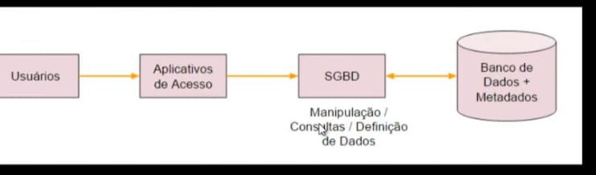

# **Dados x Informações**

Dados: São fatos em uma forma primária, que podem ser armazenados em algum meio.
. EX.: CPF, Nome, Data

Informação: São os fatos organizaddos de maneira a produzir um significado -> Dados colocados em contexto.
. Ex.: Lista de clientes com seus números de CPF, ordenados, onde os CPF estão em ordem que foram cadastrados.

# **Metadados**

. Definimos Metadados com sendo "Dados sobre os dados".
. Permitem efetuar a representação e identificação dos dados, garantindo sua consistência e persistência.
. Os Metadados são mantidos no Dicionário de Dados (ou em um Catálogo de Dados).

# **Banco de Dados**

Um banco de dados (DB) é uma coleção organizada de dados. Esses dados são organizados de modo a modelar aspectos do mundo real, para que seja possível efetuar processamento que gere informações relevantes para os usuários a partir desses dados.

Um DB é composto por diversos objetos, tais como: tabelas, esquemas, visões, consultas, relatórios, procedimentos, triggeres, entre outros. O mais importantes são as tabelas e os relacionamentos.

**Triggers**: Os triggers em banco de dados são conjuntos de ações que são automaticamente executadas em resposta a eventos específicos, como INSERT, UPDATE ou DELETE. Eles podem ser usados para:

- Manter a integridade dos dados
- Realizar auditoria
- Automatizar ações

Tipos
- Before triggers (antes da operação)
- After triggers (após a operação)

Importante
- Podem aumentar a complexidade do banco de dados
- Podem afetar o desempenho do banco de dados

# **Aplicações dos Bancos de Dados**

Bancos de dados encontram aplicações em inúmeras áreas, como:

. Sistemas bancários
. Reservas de hoteis
. Controle de estoque em supermercados
. Catálogo de livros em bibliotecas
. E-commerce
. Receita Federal
. You Tube
. Sites de comércio eletrônico
. Plataformas de redes sociais
. Blogs e portais de notícias
. Business Intelligence (BI)
. Data Mining
. Análise de dados científicos
. Aplicações de jogos online
. Plataformas de aprendizado online
. Sistemas de gerenciamento de conteúdo

# **SGBD**

. Um SGBD é uma coleção de softwares que permite aos usuários criarem e manterem um ou mais bancos de dados.
. São usados nas tarefas de definição, construção, manipulação e compartilhamento dos bancos de dados entre aplicações e usuários.
. Permitem proteger o banco de dados e mantê-lo ao longo do tempo.

# **Exemplos de SGBDs**

. Oracle DataBse
. Microsoft SQL Server - SGBDR -> SQL Server
. MySQL
. IBM DB2
. SAP Sybase
. MongoDB
. Teradata
. PostgreSQL
. SQLite

# **Sistema de Bancos de Dados

A figura a seguir ilustra a relação entre usuários, bancos de dados, SGBDs e as aplicações que acessam os dados.

# Observação.: Para colar uma imagem em um arquivo Markdown (.md) no VSCode, você pode usar a seguinte sintaxe:

# **Usuários de Bancos de Dados**

. Administrador
. Projetista / Desenvolvedor
. Usuário FAinal

# **Características e Funcionalidades**

. Controle de Redundância
. Múltiplas Visões dos Dados
. Controle de Concorrência - gerencia para evitar que um desenv. subscreva o que outro está tentando gravar.
. Backup e Restauração
. Restrições de Integridade - não poder cadastrar um produto sem que tenha o fornecedor, cadastrar o usuário sem que ele forneça o CPF para que seja escrito na tabela.

# **Modelo Hieráquico**

. Neste modelo os dados são organizaddos de forma hierárquica, com conjuntos de tipos de registros interconectados por meio de ligações.
. Uma ligação representa uma relação entre dois tipos de registros: pai e filho.
. Um esquema no modelo hierárquico é um diagrama de estrutura em árvore.
. O acesso aos dados é sempre unidirecsional, a partir do pai para o filho.

# **Modelo em Rede**

. No modelo em Redes os dados são organizados em tipos e ligações entre dois registros.
. Não há restrição hierárquica.
. Tanto o esquema quanto ocorrências de dados são visualizados como um grafo direcionado.
. (Grafo -> Tipo de estrutura de dados).

# **Mdelo em Rede**

# **Modelo Relacional**

. Neste modelo os dados são separados em entidades, conforme cada assunto, e registrados como atributos dessas entidades.
. As entidades se relacionam entre si e permitem que os dados sejam armazenados e recuperados de forma rápida e segura.

# **Introdução ao Modelo Relacional** 

